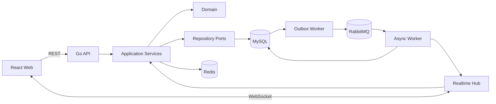
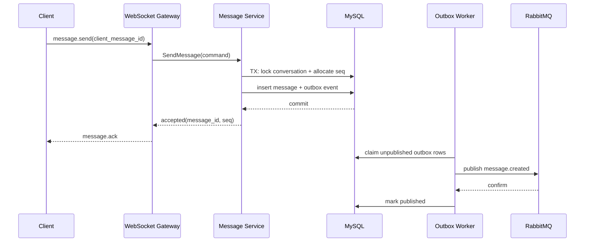

# 系统架构

## 1. 目标与约束

LinkNest IM 首先服务于单人开发、单机部署和清晰演进。当前采用模块化单体，业务量增长后再按明确边界拆分，而不是提前承担微服务的注册发现、链路追踪和分布式事务成本。

核心约束：

- MySQL 是唯一事实数据源。
- Redis 数据丢失不能导致历史消息丢失。
- 客户端可以安全重试发送请求。
- 同一会话内消息有稳定递增序号。
- HTTP 与 WebSocket 使用同一身份模型和错误码。
- 领域层不依赖 Gin、MySQL、Redis 或 RabbitMQ。

## 2. 运行时视图



API 进程负责短连接请求、WebSocket 会话和同步业务。Worker 进程负责 Outbox 投递、离线通知、媒体处理等可重试任务。两者共享领域类型，不共享运行时全局变量。

## 3. 分层依赖

```text
transport/http, realtime, platform adapters
                    |
                    v
              application
                    |
                    v
                 domain
```

| 层 | 职责 | 禁止事项 |
| --- | --- | --- |
| domain | 实体、值对象、仓储端口、领域错误 | 不导入框架和数据库包 |
| application | 编排用例、事务边界、权限规则 | 不解析 HTTP，不拼 SQL |
| transport | 参数绑定、认证上下文、响应映射 | 不直接访问数据库 |
| platform | MySQL/Redis/MQ/日志实现 | 不承载业务判断 |

## 4. 消息发送时序



`UNIQUE(sender_id, client_message_id)` 负责重试幂等；`UNIQUE(conversation_id, conversation_seq)` 负责有序性。消费端仍需按 `event_id` 去重，因为消息队列使用至少一次投递。

## 5. Redis Key 约定

Redis 仅保存可重建数据：

| Key | 类型 | 说明 | TTL |
| --- | --- | --- | --- |
| `ln:presence:{user_id}` | string | 最后心跳与设备摘要 | 90s |
| `ln:session:{session_id}` | hash | 登录会话摘要 | 7d |
| `ln:rate:{scope}:{key}` | string | 限流计数 | 按窗口 |
| `ln:conv:{id}:members` | set | 热门会话成员缓存 | 10m |
| `ln:idempotency:{user}:{key}` | string | 非消息命令幂等结果 | 10m |

禁止把完整历史消息只写入 Redis。

## 6. 横向扩展路径

1. 多 API 实例通过 Redis Pub/Sub 转发在线推送。
2. WebSocket Gateway 独立部署，应用服务保持接口不变。
3. 消息量增大后按 `conversation_id` 对 MQ 分区。
4. 附件从本地卷切到对象存储，只替换 `ObjectStore` 适配器。
5. 搜索从 MySQL 索引切到专用搜索引擎，由 `message.created` 事件增量同步。

## 7. 可观测性

每个请求和事件都携带 `request_id`、`trace_id`、`user_id`（可用时）与 `event_id`。日志使用 JSON；健康检查分为存活 `/healthz` 和依赖就绪 `/readyz`。指标和分布式追踪留在路线图中，不在骨架阶段虚构实现。

