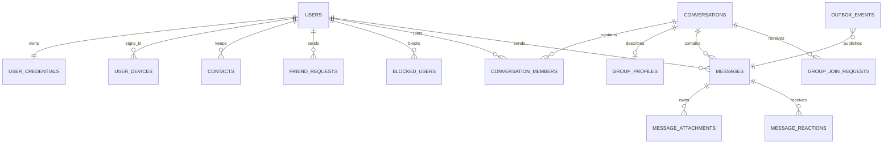

# 数据模型

完整建表语句位于 [`deploy/mysql/init/001_schema.sql`](../deploy/mysql/init/001_schema.sql)。所有时间字段使用 UTC 写入，展示时由客户端转换时区。

## 关系概览

## 表职责

| 表 | 说明 |
| --- | --- |
| `users` | 对外资料和账号状态，不保存密码 |
| `user_credentials` | 密码摘要与安全版本号 |
| `user_settings` | 用户偏好，低频扩展项可放 JSON |
| `user_devices` | 多端登录、推送令牌和最后活跃时间 |
| `refresh_tokens` | 刷新令牌摘要、轮换与吊销信息 |
| `friend_requests` | 好友申请状态机 |
| `contacts` | 用户视角的联系人备注、置顶和静音 |
| `blocked_users` | 单向拉黑关系 |
| `conversations` | 单聊、群聊的统一会话及最后序号 |
| `conversation_members` | 成员角色、入群序号、已读游标 |
| `group_profiles` | 仅群聊需要的公告、加入策略等资料 |
| `group_join_requests` | 加群审核记录 |
| `messages` | 统一消息主表和会话内顺序 |
| `message_attachments` | 文件元数据与对象存储定位 |
| `message_reactions` | 消息表情反应 |
| `outbox_events` | 与业务写入同事务的待发布事件 |
| `audit_logs` | 管理与安全敏感操作审计 |

## 关键设计

### 会话唯一性

单聊创建时，应用层将两个用户 ID 排序后生成 `direct_key`，数据库唯一索引防止重复单聊。群聊的 `direct_key` 必须为 `NULL`。

### 已读模型

成员表保存 `last_delivered_seq` 与 `last_read_seq`，不为每条消息、每个成员生成回执行。因此群规模增长时写放大可控。需要逐条审计时再追加独立事件表。

### 删除语义

- 用户侧“删除会话”只更新成员的 `hidden_before_seq`。
- 撤回消息更新 `messages.status` 与 `revoked_at`，保留审计记录。
- 账号和群组使用状态字段停用，物理清理由离线任务负责。

### Outbox

业务事务写入 `outbox_events`。Worker 使用 `FOR UPDATE SKIP LOCKED` 批量领取，发布成功后写 `published_at`。失败增加 `attempts` 并记录 `last_error`，超过阈值进入人工处理流程。

